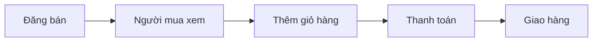

# 📋 Đặc tả Yêu cầu Phần mềm (SRS) – OOTDverse

> **Phiên bản:** 2.0 | **Cập nhật:** 26/12/2024  
> **Trạng thái:** ✅ = Hoàn thành | ⏳ = Chưa triển khai

---

## 📌 Giới thiệu tổng quan

**OOTDverse** là một nền tảng thời trang thông minh dành cho giới trẻ (Gen Z) tích hợp công nghệ **AI** và **Thực tế tăng cường (AR)** nhằm giúp người dùng quản lý tủ quần áo ảo và khám phá thế giới thời trang trực tuyến một cách sáng tạo.

### Vấn đề giải quyết

- Có nhiều quần áo nhưng khó phối được trang phục mới
- Mua sắm online dễ gặp rủi ro về size hoặc phong cách không phù hợp
- Khó khăn trong việc bán lại hoặc trao đổi quần áo cũ

### Giải pháp

- Tạo tủ đồ số từ quần áo thực
- Nhận gợi ý phối đồ thông minh từ AI
- Thử đồ ảo trước khi mua
- Tham gia mua bán quần áo
- Kết nối với cộng đồng yêu thời trang

---

## 🎯 Phạm vi dự án

| Trong phạm vi        | Ngoài phạm vi                 |
| -------------------- | ----------------------------- |
| Ứng dụng Web (SPA)   | Quy trình logistics giao nhận |
| Backend + AI Service | Phần cứng AR chuyên dụng      |
| Quản lý tủ đồ        | Mobile Native App             |
| AI Stylist           |                               |
| Marketplace          |                               |
| Thanh toán điện tử   |                               |

---

## 👥 Mô tả người dùng mục tiêu

- **Độ tuổi:** 16–25 tuổi (Gen Z)
- **Đối tượng:** Học sinh, sinh viên, người đi làm trẻ
- **Khu vực:** Thành phố lớn (Hà Nội, TP.HCM, Đà Nẵng...)
- **Đặc điểm:**
  - Hiểu biết công nghệ
  - Thích khám phá xu hướng mới
  - Chi tiêu cho thời trang qua kênh TMĐT

---

## 🔧 Các yêu cầu chức năng chính

### 1. Đăng ký/Đăng nhập ✅

| Tính năng                | Trạng thái | Ghi chú                   |
| ------------------------ | ---------- | ------------------------- |
| Đăng ký email + OTP      | ✅         | Xác thực qua email        |
| Đăng nhập email/username | ✅         | Hỗ trợ cả 2               |
| Google OAuth             | ✅         | Đã tích hợp               |
| Facebook OAuth           | ⏳         | Chưa triển khai           |
| JWT Authentication       | ✅         | Token-based               |
| Quên mật khẩu (OTP)      | ✅         | 3 bước reset              |
| Hồ sơ thời trang cá nhân | ✅         | Phong cách, số đo, avatar |

---

### 2. Quản lý Tủ đồ ảo ✅

| Tính năng                     | Trạng thái | Ghi chú                  |
| ----------------------------- | ---------- | ------------------------ |
| Thêm món đồ (upload ảnh)      | ✅         | Cloudinary storage       |
| AI nhận diện (loại, màu, mùa) | ✅         | Google Gemini AI         |
| Xem danh sách món đồ          | ✅         | Grid view                |
| Tìm kiếm/Lọc (loại, màu, mùa) | ✅         | Query filters            |
| Đánh dấu yêu thích            | ✅         | Toggle favorite          |
| Xóa món đồ                    | ✅         | Soft delete              |
| Thống kê tủ đồ                | ✅         | Category breakdown       |
| Mix & Match kéo thả           | ⏳         | Chưa có canvas mannequin |

---

### 3. AI Stylist (Gợi ý trang phục) ✅

| Tính năng                        | Trạng thái | Ghi chú                        |
| -------------------------------- | ---------- | ------------------------------ |
| Chọn bối cảnh/dịp                | ✅         | Style, occasion, weather input |
| Phân tích tủ đồ                  | ✅         | Lấy items từ DB                |
| Gợi ý 3-5 outfit                 | ✅         | Gemini AI sinh outfit          |
| Xét phong cách cá nhân           | ✅         | Skin tone, style preference    |
| Lưu outfit gợi ý                 | ✅         | Save to collection             |
| Tích hợp thời tiết (OpenWeather) | ⏳         | Chưa gọi API real-time         |
| Xu hướng thời trang (TikTok/IG)  | ⏳         | Chưa tích hợp                  |

---

### 4. Thử đồ ảo AR ⏳

| Tính năng            | Trạng thái | Ghi chú         |
| -------------------- | ---------- | --------------- |
| Upload ảnh toàn thân | ⏳         | Chưa triển khai |
| Camera AR trực tiếp  | ⏳         | Chưa triển khai |
| WebAR + Three.js     | ⏳         | Chưa triển khai |
| Pose detection       | ⏳         | Chưa triển khai |
| Chụp/lưu kết quả     | ⏳         | Chưa triển khai |

> **Ghi chú:** Đây là tính năng phức tạp, cần thời gian phát triển thêm.

---

### 5. Marketplace (Mua bán) ✅

| Tính năng               | Trạng thái | Ghi chú              |
| ----------------------- | ---------- | -------------------- |
| Đăng bán từ tủ đồ       | ✅         | Copy item info       |
| Danh sách sản phẩm      | ✅         | Pagination + filters |
| Tìm kiếm sản phẩm       | ✅         | Advanced search      |
| Chi tiết sản phẩm       | ✅         | View count tracking  |
| Boost listing           | ✅         | Đẩy sản phẩm lên top |
| Thử đồ AR trước khi mua | ⏳         | Chờ AR Try-On        |
| Chat với người bán      | ⏳         | Chưa triển khai      |

---

### 6. Trao đổi (Swap) ✅

| Tính năng          | Trạng thái | Ghi chú           |
| ------------------ | ---------- | ----------------- |
| Gửi yêu cầu swap   | ✅         | Create request    |
| Accept/Reject swap | ✅         | Response handling |
| Cập nhật shipping  | ✅         | Tracking info     |
| Đánh giá sau swap  | ✅         | Rating partner    |

---

### 7. Thanh toán ✅

| Tính năng                 | Trạng thái | Ghi chú                  |
| ------------------------- | ---------- | ------------------------ |
| VNPay                     | ✅         | Online payment           |
| MoMo                      | ✅         | E-wallet                 |
| COD (Thanh toán khi nhận) | ✅         | Cash on delivery         |
| Bank Transfer             | ✅         | Upload proof             |
| ZaloPay                   | ⏳         | Thay đổi sang VNPay/MoMo |
| Quản lý đơn hàng          | ✅         | Order tracking           |

---

### 8. Cộng đồng & Gamification ⏳

| Tính năng            | Trạng thái | Ghi chú          |
| -------------------- | ---------- | ---------------- |
| Đăng bài OOTD        | ⏳         | Placeholder page |
| Like/Comment         | ⏳         | Chưa triển khai  |
| Follow users         | ⏳         | Chưa triển khai  |
| News Feed            | ⏳         | Chưa triển khai  |
| Tag món đồ trong bài | ⏳         | Chưa triển khai  |
| Thử thách thời trang | ⏳         | Chưa triển khai  |
| Điểm/Huy hiệu        | ⏳         | Chưa triển khai  |
| Bảng xếp hạng        | ⏳         | Chưa triển khai  |

---

## ⚙️ Các yêu cầu phi chức năng

| Yêu cầu                     | Trạng thái | Ghi chú            |
| --------------------------- | ---------- | ------------------ |
| Hiệu suất cao (AI realtime) | ✅         | Gemini API nhanh   |
| JWT + OAuth bảo mật         | ✅         | Token-based auth   |
| Password hashing (bcrypt)   | ✅         | Mã hóa mật khẩu    |
| Cloud Storage (Cloudinary)  | ✅         | Đã migrate images  |
| Responsive Web              | ✅         | Next.js + Tailwind |
| Đa ngôn ngữ (VN/EN)         | ⏳         | Chưa triển khai    |

---

## 🔌 Ràng buộc hệ thống & Công nghệ

### Tech Stack đã triển khai

| Component          | Công nghệ                      |
| ------------------ | ------------------------------ |
| **Frontend**       | Next.js + React + Tailwind CSS |
| **Backend**        | Node.js + Express.js           |
| **Database**       | MongoDB (Mongoose)             |
| **AI Service**     | Python + Google Gemini API     |
| **Image Storage**  | Cloudinary                     |
| **Authentication** | JWT + bcrypt + Google OAuth    |
| **Payment**        | VNPay, MoMo, COD               |

### Thay đổi so với thiết kế ban đầu

| Hạng mục   | SRS ban đầu      | Triển khai thực tế |
| ---------- | ---------------- | ------------------ |
| AI Engine  | Generic ML       | Google Gemini AI   |
| Storage    | Firebase Storage | Cloudinary         |
| Thanh toán | ZaloPay          | VNPay, MoMo, COD   |
| Database   | Firestore        | MongoDB            |

---

## 📊 Tổng kết tiến độ

```
╔═══════════════════════════════════════════════════════════╗
║                    IMPLEMENTATION STATUS                  ║
╠═══════════════════════════════════════════════════════════╣
║  ✅ Hoàn thành:  13 tính năng                             ║
║  ⏳ Chưa làm:    11 tính năng                             ║
║  📈 Tiến độ:     54%                                      ║
╚═══════════════════════════════════════════════════════════╝
```

### Đã hoàn thành ✅

- Authentication (Email + Google OAuth + JWT)
- Virtual Wardrobe (CRUD + AI Analyze)
- AI Stylist (Outfit suggestions)
- Marketplace (Listings + Search)
- Swap (Full flow + Rating)
- Payment (VNPay + MoMo + COD)

### Roadmap (Chưa triển khai) ⏳

- 🔴 **High:** AR Try-On, Community Posts
- 🟡 **Medium:** Chat, Challenges, Weather API
- 🟢 **Low:** Gamification, TikTok/IG Trends

---

> **Xem chi tiết:** [Implementation-Status.md](./Implementation-Status.md)

---

# 📐 Đặc tả Thiết kế Phần mềm (SDS) – OOTDverse

## Kiến trúc tổng thể

```
┌─────────────────────────────────────────────────────────────┐
│                        FRONTEND                              │
│                  Next.js + React + Tailwind                  │
└─────────────────────────┬───────────────────────────────────┘
                          │ HTTPS (REST API)
                          ▼
┌─────────────────────────────────────────────────────────────┐
│                       BACKEND                                │
│                   Node.js + Express                          │
│  ┌──────────┐ ┌──────────┐ ┌──────────┐ ┌──────────┐        │
│  │ User API │ │Wardrobe  │ │Outfit API│ │Marketplace│       │
│  └──────────┘ └──────────┘ └──────────┘ └──────────┘        │
│  ┌──────────┐ ┌──────────┐ ┌──────────┐                     │
│  │ Swap API │ │Order API │ │Payment   │                     │
│  └──────────┘ └──────────┘ └──────────┘                     │
└───────┬─────────────────────────────────────────┬───────────┘
        │                                         │
        ▼                                         ▼
┌───────────────────┐                 ┌───────────────────────┐
│    AI SERVICE     │                 │     EXTERNAL APIs     │
│  Python + Gemini  │                 │  VNPay, MoMo, GHN     │
│ ┌───────────────┐ │                 └───────────────────────┘
│ │   Analyzer    │ │
│ │   Stylist     │ │
│ └───────────────┘ │
└───────┬───────────┘
        │
        ▼
┌───────────────────┐         ┌───────────────────┐
│     MongoDB       │         │    Cloudinary     │
│   (Database)      │         │  (Image Storage)  │
└───────────────────┘         └───────────────────┘
```

---

## Luồng người dùng chính

### 1. Luồng Onboarding ✅


### 2. Luồng Tủ đồ ✅


### 3. Luồng AI Stylist ✅


### 4. Luồng Marketplace ✅



---

## Thiết kế Database

### Collections (MongoDB)

| Collection     | Mô tả                | Status |
| -------------- | -------------------- | ------ |
| `users`        | Thông tin người dùng | ✅     |
| `items`        | Món đồ trong tủ      | ✅     |
| `outfits`      | Bộ outfit đã lưu     | ✅     |
| `outfititems`  | Mapping outfit-item  | ✅     |
| `marketplaces` | Listings bán hàng    | ✅     |
| `orders`       | Đơn hàng             | ✅     |
| `swaprequests` | Yêu cầu trao đổi     | ✅     |
| `addresses`    | Địa chỉ giao hàng    | ✅     |
| `settings`     | Cài đặt hệ thống     | ✅     |
| `posts`        | Bài đăng cộng đồng   | ⏳     |
| `comments`     | Bình luận            | ⏳     |
| `challenges`   | Thử thách            | ⏳     |

---

## API Endpoints

### Auth API ✅

| Method | Endpoint                     | Mô tả         |
| ------ | ---------------------------- | ------------- |
| POST   | `/api/users/register`        | Đăng ký       |
| POST   | `/api/users/verify-email`    | Xác thực OTP  |
| POST   | `/api/users/login`           | Đăng nhập     |
| POST   | `/api/users/google-login`    | Google OAuth  |
| POST   | `/api/users/forgot-password` | Quên mật khẩu |

### Wardrobe API ✅

| Method | Endpoint                | Mô tả            |
| ------ | ----------------------- | ---------------- |
| GET    | `/api/wardrobe`         | Danh sách items  |
| POST   | `/api/wardrobe`         | Thêm item        |
| PUT    | `/api/wardrobe/:id`     | Sửa item         |
| DELETE | `/api/wardrobe/:id`     | Xóa item         |
| POST   | `/api/wardrobe/analyze` | AI phân tích ảnh |

### Outfit API ✅

| Method | Endpoint                  | Mô tả             |
| ------ | ------------------------- | ----------------- |
| GET    | `/api/outfits`            | Danh sách outfits |
| POST   | `/api/outfits`            | Tạo outfit        |
| POST   | `/api/outfits/ai-suggest` | AI gợi ý          |

### Marketplace API ✅

| Method | Endpoint               | Mô tả              |
| ------ | ---------------------- | ------------------ |
| GET    | `/api/marketplace`     | Danh sách listings |
| POST   | `/api/marketplace`     | Đăng bán           |
| GET    | `/api/marketplace/:id` | Chi tiết           |

### Payment API ✅

| Method | Endpoint                    | Mô tả                |
| ------ | --------------------------- | -------------------- |
| POST   | `/api/payment/vnpay`        | Tạo thanh toán VNPay |
| POST   | `/api/payment/momo`         | Tạo thanh toán MoMo  |
| GET    | `/api/payment/vnpay-return` | Callback VNPay       |

---

## Tích hợp bên ngoài

| Service          | Status | Ghi chú              |
| ---------------- | ------ | -------------------- |
| Google OAuth     | ✅     | Đăng nhập            |
| Google Gemini    | ✅     | AI analyze + stylist |
| Cloudinary       | ✅     | Image storage        |
| VNPay            | ✅     | Thanh toán online    |
| MoMo             | ✅     | E-wallet             |
| OpenWeather      | ⏳     | Weather data         |
| TikTok/Instagram | ⏳     | Trends data          |

---

> **Tài liệu tham khảo:**
>
> - EXE101.pdf
> - REPORT_EXE101_OOTDverse_GROUP5.pdf
> - Luồng dự án.pdf
